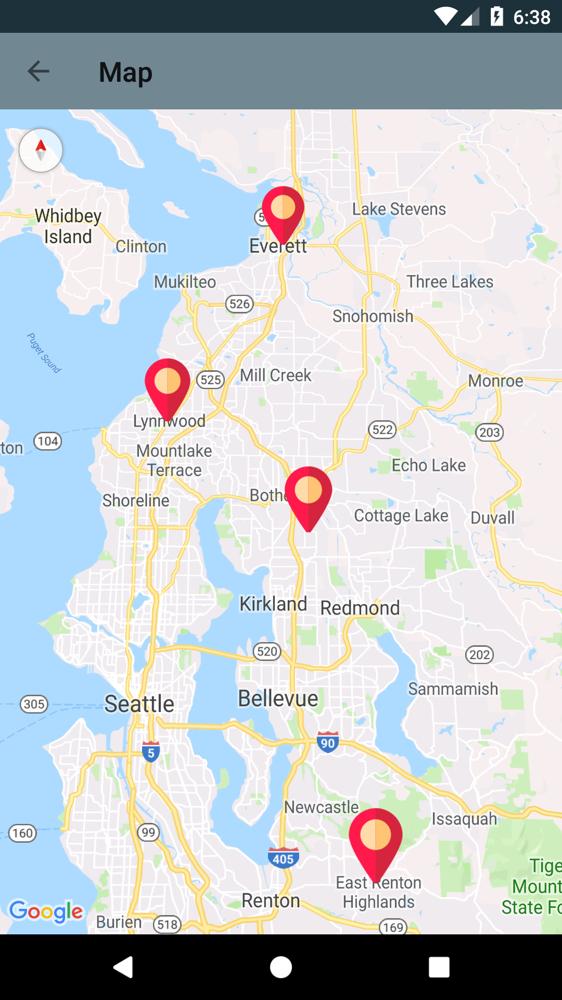
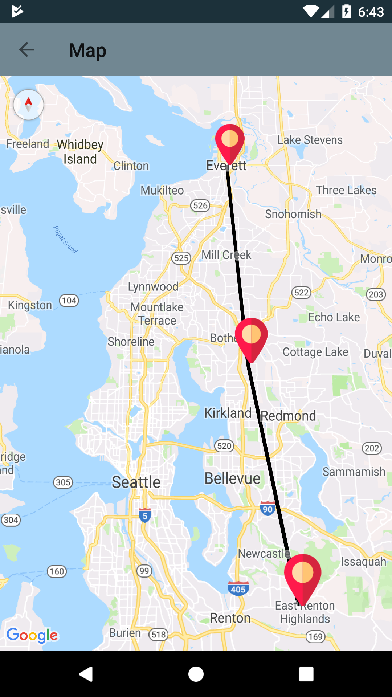

# GoogleMapAndroid
An android application created using Google Maps API showing different types of maps,streetview,animation,custom markers. 

**Third party API used:**
  
  * [Google Map API](https://developers.google.com/maps/documentation/javascript/get-api-key)

**Changing Map Type From Normal to Satellite or Hybrid:**

**Fly to Animation:**

**Custom Markers:**

**Custom Markers with Polyline:**

**Streetview:**

